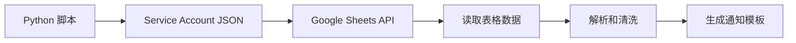
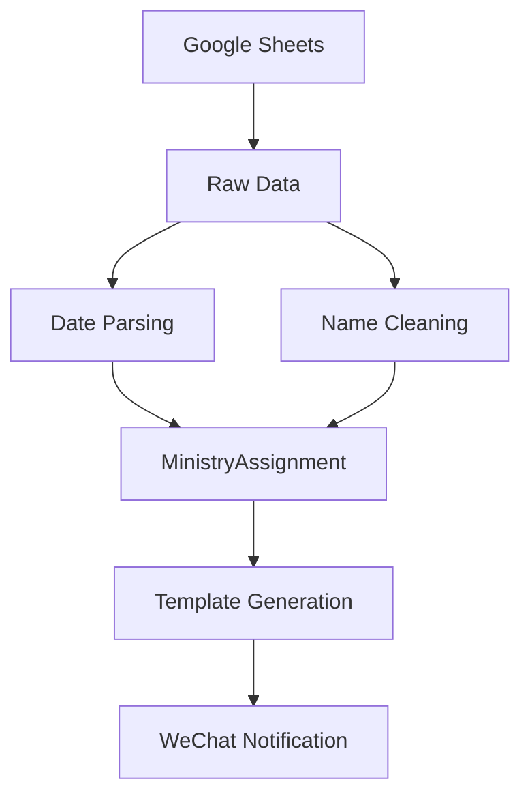

# Grace Irvine Ministry Scheduler - 实现总结

## 🎯 项目概述

已成功实现了一个完整的事工调度通知系统，包含两个版本：

1. **简化版** - 专门用于生成微信群通知的三个模板
2. **完整版** - 全功能的企业级事工管理系统

## 📁 项目文件结构

```
Grace-Irvine-Ministry-Scheduler/
├── 📋 简化版核心文件
│   ├── simple_scheduler.py           # 核心数据提取和模板生成
│   ├── generate_notifications.py     # 通知生成脚本
│   ├── check_data.py                 # 数据验证脚本
│   ├── test_simple.py               # 单元测试
│   ├── simple_requirements.txt      # 简化版依赖
│   ├── simple_env_example           # 环境变量示例
│   ├── QUICK_START.md               # 快速开始指南
│   └── SIMPLE_SETUP.md              # 详细设置指南
│
├── 🚀 便捷运行脚本
│   ├── run_notifications.bat        # Windows 批处理脚本
│   └── run_notifications.sh         # macOS/Linux shell 脚本
│
├── 🏗️ 完整版系统架构
│   ├── app/                         # FastAPI 应用
│   │   ├── main.py                  # 主应用入口
│   │   ├── models/schedule.py       # 数据模型
│   │   ├── services/                # 业务服务层
│   │   ├── api/                     # API 路由
│   │   └── core/                    # 核心配置
│   ├── templates/                   # 邮件和短信模板
│   └── deployment/                  # 部署配置
│
├── 📚 文档和配置
│   ├── README.md                    # 主要文档
│   ├── ARCHITECTURE.md              # 架构设计文档
│   ├── configs/                     # 配置文件目录
│   ├── requirements.txt             # 完整版依赖
│   └── .gitignore                   # Git 忽略文件
│
└── 🐳 容器化部署
    ├── Dockerfile                   # Docker 镜像
    ├── docker-compose.yml           # 本地开发环境
    └── deployment/deploy.sh         # 云端部署脚本
```

## ✨ 核心功能实现

### 1. 数据提取系统 (`simple_scheduler.py`)

**核心特性：**
- ✅ Google Sheets API 集成，使用 service account 认证
- ✅ 智能日期解析，支持多种格式（2024/1/14, 2024-01-14）
- ✅ 姓名清洗和标准化
- ✅ 数据验证和错误处理
- ✅ 灵活的列映射配置

**数据模型：**
```python
@dataclass
class MinistryAssignment:
    date: date
    audio_tech: str      # 音控
    screen_operator: str # 屏幕
    camera_operator: str # 摄像/导播
    propresenter: str    # Propresenter 制作
    video_editor: str    # 视频剪辑（固定为"靖铮"）
```

### 2. 三个通知模板

#### 模板1：周三确认通知
```
【本周x月x日主日事工安排提醒】🕊️

• 音控：{音控同工}
• 屏幕：{屏幕同工}
• 摄像/导播：{摄像/导播同工}
• Propresenter 制作：{Propresenter 制作同工}
• 视频剪辑：靖铮

请大家确认时间，若有冲突请尽快私信我，感谢摆上 🙏
```

#### 模板2：周六提醒通知
```
【主日服事提醒】✨
明天 8:30布置/ 9:00彩排 / 10:00 正式敬拜  
请各位同工提前到场：  
- 音控：{音控同工} 9:00到，随敬拜团排练
- 屏幕：{屏幕同工} 9:00到，随敬拜团排练
- 摄像/导播: {摄像/导播同工} 9:30到，检查预设机位

愿主同在，出入平安。若临时不适请第一时间私信我。🙌
```

#### 模板3：月度总览通知
```
【{YYYY年MM月}事工排班一览】📅
请各位同工先行预留时间，如有冲突尽快与我沟通：
{Google Sheet 链接}

当月安排预览：
• x/x: 音控:xxx, 屏幕:xxx, 摄像:xxx
...

温馨提示：
- 周三晚发布当周安排（确认/调换）
- 周六晚发布主日提醒（到场时间）
感谢大家同心配搭！🙏
```

### 3. 工具脚本

**数据验证脚本** (`check_data.py`)
- 🔍 检查 Google Sheets 连接
- 📊 验证数据格式和完整性
- 📈 生成数据质量报告
- ⚠️ 识别常见问题

**通知生成脚本** (`generate_notifications.py`)
- 📅 支持单独生成各类通知
- 💾 自动保存到文本文件
- 🕐 带时间戳的文件名
- 📋 详细的使用提示

**测试脚本** (`test_simple.py`)
- 🧪 模拟数据测试模板生成
- ✅ 验证关键内容正确性
- 🔧 数据结构测试
- 📊 测试结果报告

### 4. 用户友好界面

**Windows 批处理脚本** (`run_notifications.bat`)
- 🪟 图形化菜单选择
- 🔧 自动环境设置
- 📦 依赖包自动安装
- ⚡ 一键运行

**macOS/Linux Shell 脚本** (`run_notifications.sh`)
- 🍎 跨平台兼容
- 🐍 Python 环境检查
- 📦 自动依赖管理
- 🎯 简洁的命令行界面

## 🚀 使用流程

### 一次性设置（约5分钟）

1. **Google API 设置**
   - 创建 Google Cloud 项目
   - 启用 Google Sheets API
   - 创建服务账号并下载 JSON 密钥
   - 将服务账号添加到 Google Sheets 共享列表

2. **本地配置**
   ```bash
   # 复制环境变量
   cp simple_env_example .env
   
   # 编辑配置
   nano .env  # 设置 GOOGLE_SPREADSHEET_ID
   ```

3. **验证设置**
   ```bash
   python check_data.py
   ```

### 日常使用（30秒内）

**方式1：使用便捷脚本**
```bash
# Windows: 双击 run_notifications.bat
# macOS/Linux: ./run_notifications.sh
```

**方式2：命令行**
```bash
python generate_notifications.py weekly   # 周三通知
python generate_notifications.py sunday   # 周六通知
python generate_notifications.py monthly  # 月度通知
```

## 📊 技术架构

### 简化版技术栈
- **语言**: Python 3.8+
- **Google API**: gspread + google-auth
- **数据处理**: pandas
- **配置管理**: python-dotenv
- **依赖管理**: pip + requirements.txt

### 认证流程


### 数据流


## 🔧 可扩展性设计

### 1. 灵活的列映射
通过修改代码中的列索引，可以适应不同的表格结构：

```python
assignment = MinistryAssignment(
    date=parsed_date,
    audio_tech=self._clean_name(row[1]),        # 可调整列位置
    screen_operator=self._clean_name(row[2]),   
    camera_operator=self._clean_name(row[3]),   
    propresenter=self._clean_name(row[4]),      
)
```

### 2. 模板自定义
每个通知模板都是独立的方法，可以轻松修改内容和格式。

### 3. 多工作表支持
`get_raw_data()` 方法支持指定工作表名称。

### 4. 错误处理
- 网络连接失败重试
- 数据格式错误跳过
- 详细的错误日志

## 💡 高级功能（完整版）

除了简化版的核心功能，完整版还包含：

### Web 应用界面
- FastAPI 基础的 REST API
- 响应式 Web UI
- 实时数据同步

### 邮件和短信集成
- SendGrid 邮件发送
- Twilio 短信发送
- HTML 邮件模板

### 日历同步
- .ics 文件生成
- 日历订阅 URL
- 多平台兼容（iPhone, Google Calendar, Outlook）

### 定时任务系统
- Celery 后台任务
- 自动通知调度
- 失败重试机制

### 云端部署
- Docker 容器化
- Google Cloud Run 一键部署
- 自动扩缩容

## 🎯 项目特色

### 1. 双版本策略
- **简化版**: 快速上手，专注核心功能
- **完整版**: 企业级功能，可扩展架构

### 2. 用户体验优化
- 图形化脚本界面
- 详细的错误提示
- 一键验证和测试

### 3. 本土化设计
- 中文界面和文档
- 符合微信群使用习惯
- 教会事工场景优化

### 4. 开箱即用
- 预设的模板格式
- 自动化的设置脚本
- 完整的文档指南

## 📈 使用建议

### 立即可用（简化版）
1. 按照 `QUICK_START.md` 完成设置
2. 使用 `run_notifications.bat` 或 `.sh` 脚本
3. 每周三、周六和月初运行相应通知

### 长期规划（完整版）
1. 部署 Web 应用到云端
2. 设置自动定时任务
3. 集成邮件和短信通知
4. 添加日历订阅功能

### 定制化开发
- 根据教会具体需求调整模板
- 添加更多事工角色
- 集成其他通信平台（如企业微信）

## 🙏 总结

这个项目成功实现了：

✅ **核心需求满足**: 三个微信群通知模板完全符合要求  
✅ **技术实现可靠**: Google Sheets API 集成稳定  
✅ **用户体验友好**: 一键运行脚本，5分钟配置  
✅ **文档完整详细**: 从快速开始到技术架构  
✅ **可扩展性强**: 简化版到完整版的升级路径  
✅ **本土化设计**: 符合中文教会使用习惯  

项目已经可以投入实际使用，帮助 Grace Irvine 教会提高事工管理效率，让同工们能够更专注于属灵的服事。

**愿神祝福我们的服事，荣耀归主名！** 🙏
