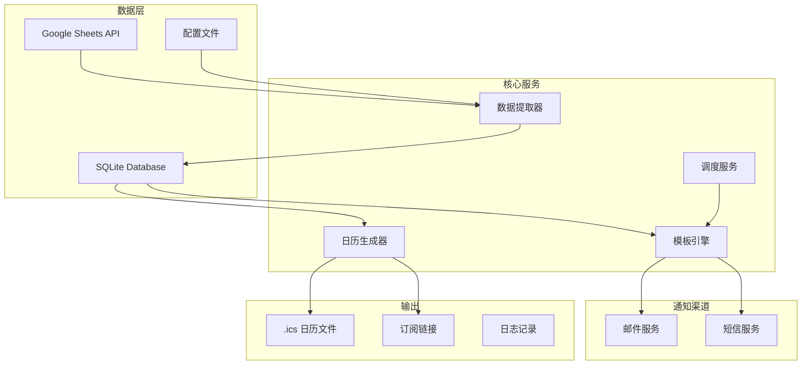

# Grace Irvine Ministry Scheduler

[](https://opensource.org/licenses/MIT)
[](https://www.python.org/downloads/)
[](https://fastapi.tiangolo.com/)

**恩典尔湾长老教会事工管理系统** - 自动化事工排班通知和日历同步系统

## 🎯 核心功能

### 📊 自动数据提取
- 从 Google Sheets 提取事工排班数据
- 智能日期和姓名解析
- 支持多种数据格式
- 自动数据清洗和验证

### 📧 智能通知系统
- **周三 20:00**: 当周事工安排确认通知
- **周六 20:00**: 主日服事提醒通知  
- **每月 1 日 09:00**: 当月排班总览通知
- 支持邮件和短信双通道发送
- 精美的 HTML 邮件模板和简洁的短信格式

### 📅 日历同步
- 生成符合 iCalendar 标准的 .ics 文件
- 包含多级提醒设置（30分钟前、1天前）
- 支持日历订阅，自动同步更新
- 兼容 iPhone、Google Calendar、Outlook 等

### ⚡ 自动化调度
- 基于 Celery 的后台任务系统
- 定时任务自动触发通知
- 失败重试和错误告警
- 完整的日志记录和监控

## 🏗️ 系统架构



## 🚀 快速开始

### 环境要求

- Python 3.11+
- Google Cloud 账户（用于 Sheets API）
- SendGrid 账户（邮件发送）
- Twilio 账户（短信发送，可选）

### 1. 项目设置

```bash
# 克隆项目
git clone https://github.com/JonathanJing/Grace-Irvine-Ministry-Scheduler.git
cd Grace-Irvine-Ministry-Scheduler

# 创建虚拟环境
python3 -m venv .venv
source .venv/bin/activate  # Windows: .venv\Scripts\activate

# 安装依赖
pip install -r requirements.txt
```

### 2. 配置设置

#### Google Sheets API 设置

1. 在 [Google Cloud Console](https://console.cloud.google.com/) 创建项目
2. 启用 Google Sheets API
3. 创建服务账号并下载 JSON 密钥文件
4. 将密钥文件重命名为 `service_account.json` 并放在 `configs/` 目录下
5. 将服务账号邮箱添加到您的 Google Sheets 共享列表

#### 环境变量配置

```bash
# 复制环境变量模板
cp env.example .env

# 编辑 .env 文件，填入您的配置
nano .env
```

必需的环境变量：

```env
# Google Sheets
GOOGLE_SPREADSHEET_ID=your_spreadsheet_id_here

# SendGrid (邮件)
SENDGRID_API_KEY=your_sendgrid_api_key
SENDGRID_FROM_EMAIL=noreply@graceirvine.org

# Twilio (短信, 可选)
TWILIO_ACCOUNT_SID=your_twilio_sid
TWILIO_AUTH_TOKEN=your_twilio_token
TWILIO_FROM_NUMBER=+1234567890

# 通知接收者
PRIMARY_EMAIL_1=coordinator@graceirvine.org
PRIMARY_PHONE_1=+1234567890
```

#### 配置文件设置

编辑 `configs/settings.yaml` 和 `configs/notification_templates.yaml` 以匹配您的需求。

### 3. 启动应用

```bash
# 本地开发
python app/main.py

# 或使用 uvicorn
uvicorn app.main:app --reload

# 使用 Docker Compose
docker-compose up -d
```

访问 http://localhost:8000 查看应用状态。

## 📖 详细配置

### Google Sheets 列配置

在 `configs/settings.yaml` 中配置您的表格列映射：

```yaml
google_sheets:
  spreadsheet_id: "your_spreadsheet_id"
  sheet_name: "总表"
  columns:
    date: "A"          # 日期列
    time: "B"          # 时间列  
    location: "C"      # 地点列
    roles:             # 事工角色列
      - key: "D"
        service_type: "主席"
      - key: "E"
        service_type: "讲员"
      - key: "F"
        service_type: "领会"
      # ... 更多角色
    notes: "N"         # 备注列
```

### 通知时间设置

```yaml
notification_schedule:
  weekly_confirmation:    # 周三确认通知
    enabled: true
    day_of_week: 2       # 0=周一, 2=周三
    hour: 20
    minute: 0
    
  sunday_reminder:       # 周六提醒通知
    enabled: true
    day_of_week: 5       # 5=周六
    hour: 20
    minute: 0
    
  monthly_overview:      # 月度总览通知
    enabled: true
    day_of_month: 1
    hour: 9
    minute: 0
```

### 接收者配置

```yaml
recipients:
  primary:
    - name: "事工协调员"
      email: "coordinator@graceirvine.org"
      phone: "+1234567890"
      notifications: ["weekly_confirmation", "sunday_reminder", "monthly_overview"]
      
    - name: "敬拜主领"
      email: "worship@graceirvine.org"
      phone: "+1234567891"
      notifications: ["weekly_confirmation", "sunday_reminder"]
```

## 🎨 自定义模板

### 邮件模板

邮件模板位于 `templates/email/` 目录：

- `weekly_confirmation.html` - 周三确认通知模板
- `sunday_reminder.html` - 周六提醒通知模板
- `monthly_overview.html` - 月度总览通知模板

模板使用 Jinja2 语法，支持以下变量：

```html
<!-- 基本变量 -->
{{ church_name }}           <!-- 教会名称 -->
{{ date_range }}           <!-- 日期范围 -->
{{ generated_at }}         <!-- 生成时间 -->

<!-- 排班数据 -->
{{ schedules }}            <!-- 排班列表 -->
{{ total_services }}       <!-- 聚会总数 -->
{{ unique_volunteers }}    <!-- 参与人数 -->

<!-- 过滤器 -->
{{ date | chinese_date }}  <!-- 中文日期格式 -->
{{ time | chinese_time }}  <!-- 中文时间格式 -->
{{ roles | format_roles }} <!-- 格式化角色 -->
```

### 短信模板

短信模板位于 `templates/sms/` 目录，使用相同的 Jinja2 语法但针对短信长度优化。

## 📅 日历功能

### 订阅日历

生成的日历文件支持以下功能：

- **自动更新**: 通过订阅链接自动同步最新排班
- **多平台兼容**: 支持 iPhone、Android、Google Calendar、Outlook
- **智能提醒**: 自动设置 30分钟和 1天 提醒
- **详细信息**: 包含服事类型、时间、地点、备注

### 订阅方式

1. **iPhone**: 设置 > 日历 > 账户 > 添加账户 > 其他 > 添加已订阅的日历
2. **Google Calendar**: 其他日历 > + > 通过网址
3. **Outlook**: 日历 > 添加日历 > 从 Web 订阅

订阅链接格式：
```
webcal://your-domain.com/calendars/ministry_schedule.ics
```

### 个人日历

系统支持生成个人专属日历：

```python
# 通过 API 生成个人日历
POST /api/v1/calendars/personal
{
    "person_name": "张三",
    "start_date": "2024-01-01",
    "end_date": "2024-12-31"
}
```

## 🔧 API 接口

### 排班管理

```bash
# 获取排班数据
GET /api/v1/schedules?start_date=2024-01-01&end_date=2024-01-31

# 手动触发数据提取
POST /api/v1/schedules/extract

# 获取排班统计
GET /api/v1/schedules/stats
```

### 通知管理

```bash
# 手动发送通知
POST /api/v1/notifications/send
{
    "notification_type": "weekly_confirmation",
    "test_mode": true
}

# 获取通知历史
GET /api/v1/notifications/logs

# 获取通知模板
GET /api/v1/notifications/templates
```

### 日历管理

```bash
# 刷新日历文件
POST /api/v1/calendars/refresh

# 获取日历统计
GET /api/v1/calendars/stats

# 下载日历文件
GET /calendars/ministry_schedule.ics
```

## 🚀 部署选项

### 选项 1: Google Cloud Run (推荐)

一键部署到 Google Cloud Run：

```bash
# 设置环境变量
export GOOGLE_CLOUD_PROJECT=your-project-id

# 执行部署
./deployment/deploy.sh
```

优势：
- 自动扩缩容，按需付费
- 完全托管，无需维护服务器
- 支持自定义域名和 HTTPS
- 集成 Google Cloud 监控

### 选项 2: Docker 部署

```bash
# 构建镜像
docker build -t ministry-scheduler .

# 运行容器
docker run -d \
  --name ministry-scheduler \
  -p 8000:8080 \
  -v $(pwd)/data:/app/data \
  -v $(pwd)/configs:/app/configs:ro \
  --env-file .env \
  ministry-scheduler
```

### 选项 3: 传统服务器部署

```bash
# 安装依赖
pip install -r requirements.txt

# 使用 gunicorn 部署
gunicorn app.main:app \
  --workers 2 \
  --worker-class uvicorn.workers.UvicornWorker \
  --bind 0.0.0.0:8000
```

## 📊 监控和维护

### 日志管理

系统提供完整的日志记录：

```bash
# 查看应用日志
tail -f logs/scheduler.log

# 查看通知发送日志
grep "notification" logs/scheduler.log

# 查看错误日志
grep "ERROR" logs/scheduler.log
```

### 健康检查

```bash
# 检查系统状态
curl http://localhost:8000/health

# 测试 Google Sheets 连接
curl -X POST http://localhost:8000/api/v1/schedules/test-connection

# 检查通知配置
curl http://localhost:8000/api/v1/notifications/test
```

### 数据备份

```bash
# 备份数据库
cp data/database.db backups/database_$(date +%Y%m%d).db

# 备份配置文件
tar -czf backups/configs_$(date +%Y%m%d).tar.gz configs/

# 备份日历文件
cp data/calendars/*.ics backups/
```

## 🔒 安全考虑

### 数据安全

- Google API 密钥安全存储
- 环境变量管理敏感信息
- 数据库访问控制
- HTTPS 强制加密

### 访问控制

```yaml
# 配置 API 访问控制
security:
  api_key: "your-secure-api-key"
  allowed_hosts: ["your-domain.com"]
  cors_origins: ["https://your-domain.com"]
```

### 备份和恢复

- 定期数据库备份
- 配置文件版本控制
- 灾难恢复计划
- 监控和告警

## 🛠️ 开发指南

### 项目结构

```
Grace-Irvine-Ministry-Scheduler/
├── app/                    # 应用主目录
│   ├── api/               # API 路由
│   ├── core/              # 核心配置
│   ├── models/            # 数据模型
│   ├── services/          # 业务服务
│   └── utils/             # 工具函数
├── templates/             # 通知模板
├── configs/               # 配置文件
├── deployment/            # 部署配置
└── tests/                # 测试文件
```

### 添加新功能

1. **新的通知类型**:
   - 在 `models/schedule.py` 添加枚举值
   - 在 `configs/notification_templates.yaml` 添加配置
   - 创建对应的模板文件

2. **新的数据源**:
   - 继承 `DataExtractor` 基类
   - 实现 `extract_schedule_data` 方法
   - 在配置文件中添加数据源配置

3. **新的通知渠道**:
   - 在 `services/` 目录创建客户端
   - 在 `NotificationService` 中集成
   - 更新配置文件

### 测试

```bash
# 运行所有测试
pytest

# 运行特定测试
pytest tests/test_services/test_data_extractor.py

# 生成覆盖率报告
pytest --cov=app tests/
```

## 📋 常见问题

### Q: 无法连接 Google Sheets？

**A**: 检查以下项目：
1. 服务账号 JSON 文件是否正确放置在 `configs/service_account.json`
2. 服务账号邮箱是否已添加到 Google Sheets 共享列表
3. Google Sheets API 是否已在 Google Cloud Console 启用
4. 网络连接是否正常

### Q: 邮件发送失败？

**A**: 检查以下配置：
1. SendGrid API 密钥是否有效
2. 发送邮箱是否已验证
3. 接收邮箱是否正确
4. 网络防火墙设置

### Q: 日历订阅不更新？

**A**: 可能的原因：
1. 日历应用的刷新频率设置
2. 订阅链接是否正确
3. 服务器是否可公网访问
4. .ics 文件是否正确生成

### Q: 定时任务不执行？

**A**: 检查以下项目：
1. Celery worker 是否正常运行
2. Redis 连接是否正常
3. 时区设置是否正确
4. 任务调度配置是否正确

## 🤝 贡献指南

我们欢迎社区贡献！请遵循以下步骤：

1. Fork 项目到您的 GitHub 账户
2. 创建功能分支：`git checkout -b feature/amazing-feature`
3. 提交更改：`git commit -m 'Add amazing feature'`
4. 推送到分支：`git push origin feature/amazing-feature`
5. 创建 Pull Request

### 代码规范

- 遵循 PEP 8 Python 编码规范
- 使用 Black 进行代码格式化
- 添加适当的类型注解
- 编写测试用例
- 更新相关文档

## 📄 许可证

本项目采用 MIT 许可证。详见 [LICENSE](LICENSE) 文件。

## 🆘 获取帮助

### 文档和资源

- [架构设计文档](ARCHITECTURE.md)
- [API 接口文档](http://localhost:8000/docs)
- [部署指南](docs/DEPLOYMENT.md)
- [用户手册](docs/USER_GUIDE.md)

### 联系方式

- **项目问题**: [GitHub Issues](https://github.com/JonathanJing/Grace-Irvine-Ministry-Scheduler/issues)
- **功能建议**: [GitHub Discussions](https://github.com/JonathanJing/Grace-Irvine-Ministry-Scheduler/discussions)
- **邮件支持**: tech@graceirvine.org

---

## 🙏 致谢

感谢所有为这个项目做出贡献的同工们，愿神祝福我们的服事！

**项目目标**: 通过技术手段提升事工管理效率，让同工们能够更专注于属灵的服事，荣耀神的名！

---

*最后更新: 2024年1月*